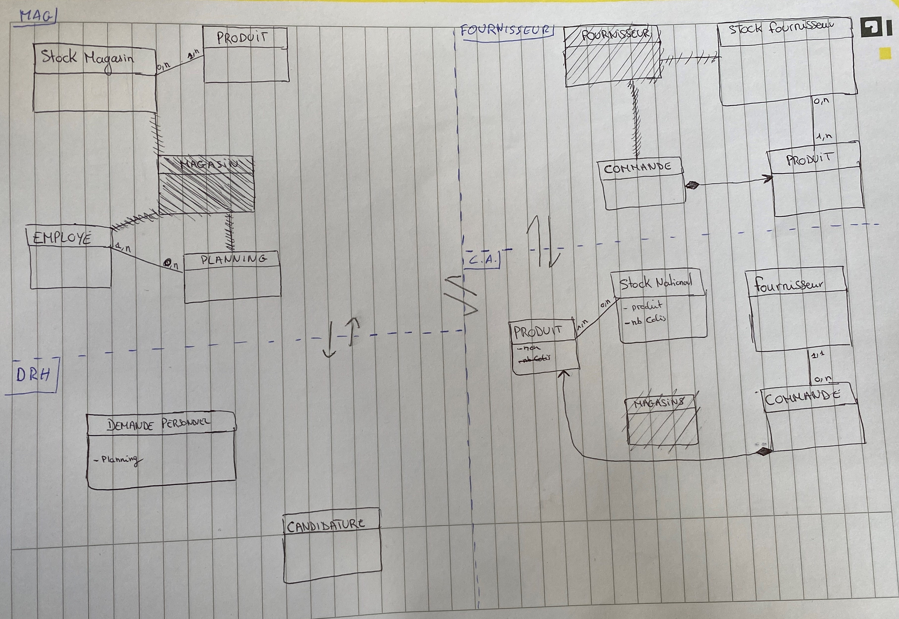

# Projet iMarket

## Objectifs du système à modéliser

On propose de modéliser un système qui permettrait d’informatiser la gestion d’un magasin (MAG) pouvant gérer les ressources en termes de personnel avec la direction RH (DRH) et de marchandise avec le contact d’achat (CA) qui vas répondre à ces demandes en passant des commandes aux fournisseurs (FOURNISSEUR).

Le MAG gère les plannings des employées en prenant en compte les contraintes jours/horaires/CP/absences des différents salarié.  Lorsqu’une anomalie est détectée (impossible de respecter le quota jour/hommes) un mail contenant un fichier PDF qui est envoyé à la direction RH afin qu’ils soient alertés de la situation et puissent retourner un ou plusieurs CV.

Le MAG gère également l’approvisionnement de son stock en envoyant tous les 2 jours au Contact d’Achat un fichier JSON.
-	Contenant le stock actuel de son magasin (possibilité de faire une fonction qui calcule le nombre de produits à envoyer)
     OU
-	Contenant les produits en rupture de son magasin

La DRH gère les candidatures reçues en stockant les CV des candidats dans sa base et lorsqu’elle reçoit une demande de personnel elle retourne 5 CV correspondant aux postes recherchés. (Exemple : 5 CV contrats étudiants, 5 CV responsables etc…)

Le CA reçoit le stock de marchandises du magasin, traite le fichier en fonction de son stock national.
-	SI le stock est suffisant on envoie directement les produit au magasin puis on vérifie que le stock national restant est > 100 colis (limiteColis)
-	Sinon il envoi au fournisseur un fichier XML contenant les produits devant être livré au magasin ainsi que le nombre de colis à recevoir (nbColisDansStockNat = 2 * limiteColis).

Le Fournisseur reçoit un fichier XML contenant la liste des produits à envoyer au magasin, et retourne les produits qu’il possède.

### Hypothèses

-	Le fournisseur possède un stock infini.
-	La demande de candidature est importante et on nécessite une demande de réponse direct pour avoir une communication synchrone.

### Diagramme de classe

